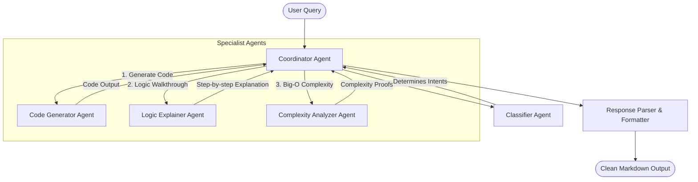

# AI-Powered Algorithm Generation and Explanation Agent

An intelligent, multi-agent conversational tutoring and development system designed to assist computer science students, competitive programmers, and software developers. The agent accepts natural language queries, classifies user intent, generates syntax-correct algorithms, provides step-by-step logic explanations (using Chain-of-Thought reasoning), and performs asymptotic complexity analysis.

Developed as part of the Artificial Intelligence Course (Project Module-2) at the Software Engineering Department, University of Engineering and Technology (UET), Taxila.

## 👥 Group Members
*   **Muhammad Taqi** (22-SE-52)
*   **Ali Hussnain** (22-SE-100)
*   **Submitted to:** Dr. Kanwal Yousaf

---

## 🏗️ System Architecture & Workflow

The system uses a **Coordinator-Agent** design pattern that orchestrates specialist agents to process queries in structured pipeline stages:



### 🤖 Agent Roles
1.  **Coordinator Agent:** Orchestrates communication, populates context, and formats the aggregated markdown output.
2.  **Classifier Agent:** Classifies user intent into one or more categories: `GENERATE`, `EXPLAIN`, `ANALYZE`, or `COMPARE`.
3.  **Code Generator Agent:** Writes optimized, modular, and syntax-correct code in the target programming language (Python, C++, Java, JavaScript).
4.  **Logic Explainer Agent:** Generates conceptual walkthroughs and dry-runs using Chain-of-Thought (CoT) reasoning.
5.  **Complexity Analyzer Agent:** Derives mathematical time and space complexity bounds.

---

## ⚡ Setup & Installation

### Prerequisites
*   Python 3.10 or higher
*   Google Gemini API Key or OpenAI API Key

### 1. Clone the Repository
```bash
git clone https://github.com/yourusername/ai-algorithm-agent.git
cd ai-algorithm-agent
```

### 2. Install Dependencies
```bash
pip install streamlit requests
```

### 3. Configure API Keys
Set your API keys as environment variables:

**Windows (PowerShell):**
```powershell
$env:GEMINI_API_KEY="your-gemini-key-here"
$env:OPENAI_API_KEY="your-openai-key-here"
```

**Linux/macOS:**
```bash
export GEMINI_API_KEY="your-gemini-key-here"
export OPENAI_API_KEY="your-openai-key-here"
```

### 4. Run the Streamlit Application
```bash
streamlit run app.py
```

---

## 📊 Experimental Evaluation

The agent was evaluated against multiple baselines using a benchmark of 10 complex computational problems. The primary metrics measured include **Code Correctness**, **Explanation Clarity** (scale 1-5), **Complexity Accuracy**, **Response Latency**, and **Token Efficiency**.

### Comparison Table

| Configuration | Code Correctness (↑) | Explanation Score (1-5) (↑) | Complexity Accuracy (↑) | Avg Latency (↓) | Avg Tokens (↓) |
| :--- | :---: | :---: | :---: | :---: | :---: |
| **Proposed Agent (Gemini 1.5 Pro)** | **100.0%** | **4.88** | **100.0%** | 4.51s | 2765 |
| Proposed Agent (Gemini 1.5 Flash) | 100.0% | 4.58 | 90.0% | 3.12s | 2621 |
| Baseline (Zero-Shot GPT-4o mini) | 72.0% | 2.56 | 63.0% | 2.37s | 1240 |
| Baseline (Single-Prompt Flash) | 81.0% | 4.57 | 72.0% | 2.85s | 2679 |
| Ablation (w/o Routing Classifier) | 54.0% | 4.65 | 90.0% | 2.67s | 2718 |

---

## 📂 Project Structure
*   `app.py`: Main Streamlit web application.
*   `agents.py`: Classes for LLM integration and agent coordination.
*   `config.py`: Prompt templates and environment variable bindings.
*   `evaluator.py`: CLI script to run the benchmarking suite and generate results.
*   `evaluation_results.csv`: Saved CSV file from the benchmark run.
